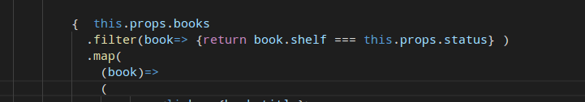
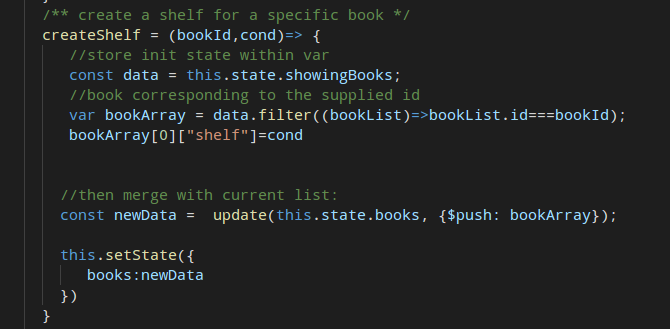

# myreadsReactProject
A react project that demonstrates fundamental building blocks of react ecosystem (component, props, states, router).

`$ npm start` for dependencies installation

`$ yarn start` to run server

Environment: Firefox latest (don't work on chrome, I don't know why...)

## Approach:

I decided to use 03 different `components` even I should use only one to render books into 03 categories (read, want to read, currently reading). They are:

 * `ListBooksCurrentRead` for displaying currently reading books 

 * `ListBooksRead` for displaying books that had been read

 * `ListBooksToRead` for todo read

 They share the same state but filtered for each component custom attribut called `status`:

A new component is also created to handle list of books found by search keywords of the API Udacity provides us. It has basically the same strcuture as `ListBooks**` components except a modified function to create shelf status because they don't have one (on click options).

