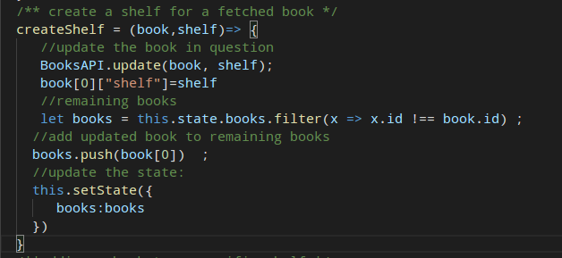

# myreadsReactProject
A react project that demonstrates fundamental building blocks of react ecosystem (component, props, states, router).

## Dependencies intallation

`$ npm install -g react-router-dom`

## Start playing with the App:

`$ yarn start` 

## Approach:

One single `component` (`ListBooks`) cloned into 03 to handle 03 shelves (read, want to read, currently reading). 

 
A new component is also created to handle list of books found by search keywords of the API Udacity provides us. It has basically the same structure as `ListBooks` components except a modified function to create shelf status because they don't have one (on click options).

